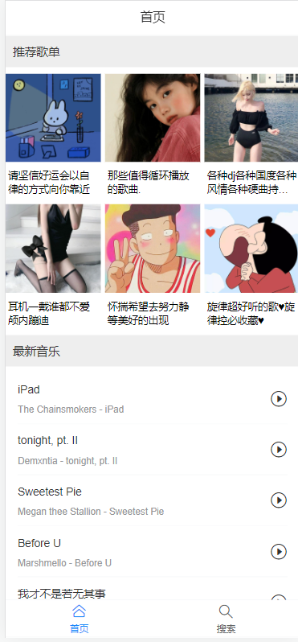
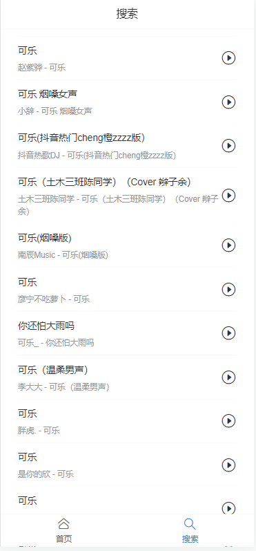
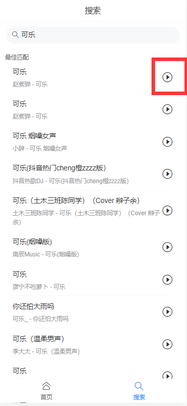

# music-demo

## Project setup
```
npm install
```

### Compiles and hot-reloads for development
```
npm run serve
```

### Compiles and minifies for production
```
npm run build
```

### Lints and fixes files
```
npm run lint
```

### Customize configuration
See [Configuration Reference](https://cli.vuejs.org/config/).

后台接口用的是NodeJs版网易云，GitHub地址是 https://github.com/Binaryify/NeteaseCloudMusicApi

使用van组件进行布局

Layout(布局, 顶部导航和底部导航) > 二级路由 Home 和 Search

Play

## 首页



### 推荐歌单

获取歌单信息，并循环显示

### 最新音乐

获取最新音乐，列表循环

## 搜索

获取热门搜索，循环显示

绑定点击事件，点击文字填充到输入框，并显示搜索结果，搜索结果底部出发onload事件，用以加载更多结果




## play页面

点击播放图标，通过路由跳转将歌曲id传过去




点击中间播放，下方显示歌词


